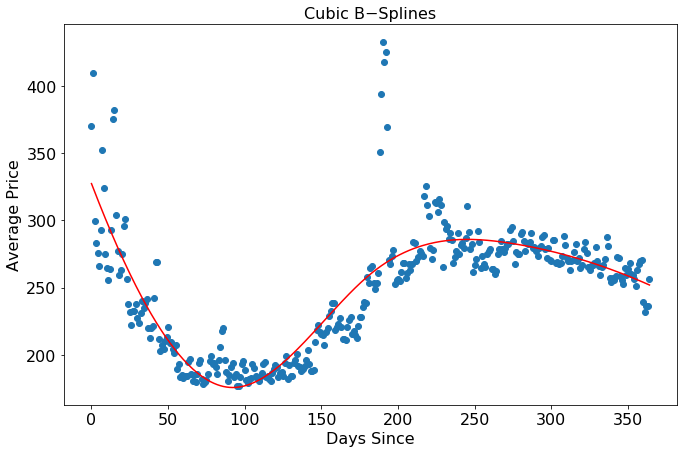
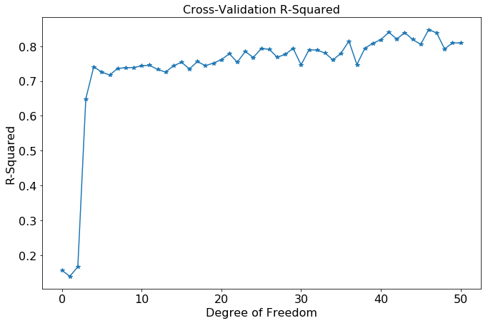
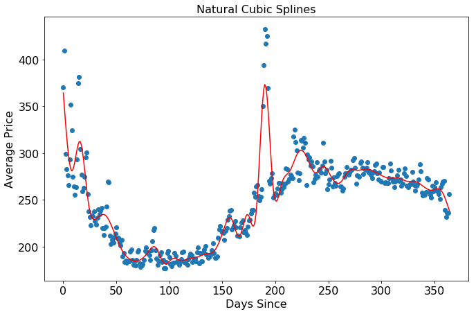
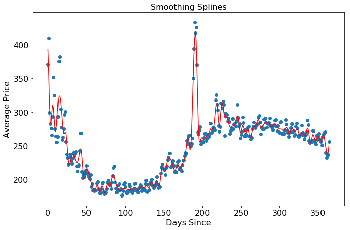
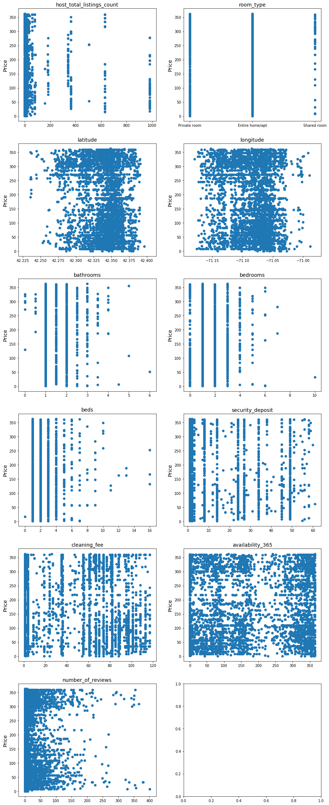

## Contents
{:.no_toc}
*  
{: toc}


```python
import requests
from IPython.core.display import HTML
styles = requests.get("https://raw.githubusercontent.com/Harvard-IACS/2019-CS109B/master/content/styles/cs109.css").text
HTML(styles)
```


<style>
blockquote { background: #AEDE94; }
h1 { 
    padding-top: 25px;
    padding-bottom: 25px;
    text-align: left; 
    padding-left: 10px;
    background-color: #DDDDDD; 
    color: black;
}
h2 { 
    padding-top: 10px;
    padding-bottom: 10px;
    text-align: left; 
    padding-left: 5px;
    background-color: #EEEEEE; 
    color: black;
}

div.exercise {
	background-color: #ffcccc;
	border-color: #E9967A; 	
	border-left: 5px solid #800080; 
	padding: 0.5em;
}
div.discussion {
	background-color: #ccffcc;
	border-color: #88E97A;
	border-left: 5px solid #0A8000; 
	padding: 0.5em;
}
div.theme {
	background-color: #DDDDDD;
	border-color: #E9967A; 	
	border-left: 5px solid #800080; 
	padding: 0.5em;
	font-size: 18pt;
}
div.gc { 
	background-color: #AEDE94;
	border-color: #E9967A; 	 
	border-left: 5px solid #800080; 
	padding: 0.5em;
	font-size: 12pt;
}
p.q1 { 
    padding-top: 5px;
    padding-bottom: 5px;
    text-align: left; 
    padding-left: 5px;
    background-color: #EEEEEE; 
    color: black;
}
header {
   padding-top: 35px;
    padding-bottom: 35px;
    text-align: left; 
    padding-left: 10px;
    background-color: #DDDDDD; 
    color: black;
}
</style>


```python
## these two lines for JupyterHub only
import os
os.environ['R_HOME'] = "/usr/share/anaconda3/lib/R"

import pandas as pd
import numpy as np
import datetime
import matplotlib.pyplot as plt
%matplotlib inline
import statsmodels.formula.api as sm
import rpy2.robjects as robjects
from rpy2.robjects.packages import importr
from sklearn.preprocessing import PolynomialFeatures

r_utils = importr('utils')

## if there are errors about missing R packages, uncomment and run the lines below:
## r_utils.install_packages('codetools')
## r_utils.install_packages('gam')
r_splines = importr('splines')
r_smooth_spline = robjects.r['smooth.spline'] #extract R function
r_gam_lib = importr('gam')
r_gam = r_gam_lib.gam #extract R function
r_glm = robjects.r['glm'] #extract R function
r_anova = robjects.r['anova'] #extract R function

from sklearn.metrics import r2_score
from sklearn.model_selection import KFold
import seaborn as sns

import warnings
warnings.filterwarnings('ignore')
```


## Modeling Seasonality of Airbnb Prices
In this problem, the task is to build a regression model to predict the price of an Airbnb rental for a given date. The data are provided in `calendar_train.csv` and `calendar_test.csv`, which contain availability and price data for Airbnb units in the Boston area from 2017 to 2018. Note that some of the rows in the `.csv` file refer to dates in the future. These refer to bookings that have been made far in advance.


```python
## Read the data
cal_train = pd.read_csv("data/calendar_train.csv")
cal_test = pd.read_csv("data/calendar_test.csv")
```


```python
cal_train.head()
```


<div>
<style scoped>
    .dataframe tbody tr th:only-of-type {
        vertical-align: middle;
    }

    .dataframe tbody tr th {
        vertical-align: top;
    }

    .dataframe thead th {
        text-align: right;
    }
</style>
<table border="1" class="dataframe">
  <thead>
    <tr style="text-align: right;">
      <th></th>
      <th>listing_id</th>
      <th>date</th>
      <th>available</th>
      <th>price</th>
    </tr>
  </thead>
  <tbody>
    <tr>
      <th>0</th>
      <td>20872145</td>
      <td>9/21/18</td>
      <td>f</td>
      <td>NaN</td>
    </tr>
    <tr>
      <th>1</th>
      <td>20872145</td>
      <td>9/19/18</td>
      <td>f</td>
      <td>NaN</td>
    </tr>
    <tr>
      <th>2</th>
      <td>20872145</td>
      <td>9/18/18</td>
      <td>f</td>
      <td>NaN</td>
    </tr>
    <tr>
      <th>3</th>
      <td>20872145</td>
      <td>9/17/18</td>
      <td>f</td>
      <td>NaN</td>
    </tr>
    <tr>
      <th>4</th>
      <td>20872145</td>
      <td>9/16/18</td>
      <td>f</td>
      <td>NaN</td>
    </tr>
  </tbody>
</table>
</div>


```python
print(cal_train.shape, cal_test.shape)
```


    (734003, 4) (314572, 4)


### Exploratory Analysis

Visualize the average price by month and day of the week (i.e., Monday, Tuesday, etc.) for the training set. Point out any trends you notice and explain whether or not they make sense.

*Hint*: You will want to first convert the `date` column into Python dates using `datetime.datetime.strptime(arg1,arg2).date()` and providing the appropriate arguments.


```python
## Change the date format
cal_train['date'] = pd.to_datetime(cal_train['date'], format="%m/%d/%y")
cal_test['date'] = pd.to_datetime(cal_test['date'], format="%m/%d/%y")
```


```python
## Generate day and momth columns
cal_train['day'] = cal_train['date'].apply(lambda x: x.strftime('%a'))
cal_train['month'] = cal_train['date'].apply(lambda x: x.strftime('%m'))

cal_test['day'] = cal_test['date'].apply(lambda x: x.strftime('%a'))
cal_test['month'] = cal_test['date'].apply(lambda x: x.strftime('%m'))
```


```python
cal_train.head()
```


<div>
<style scoped>
    .dataframe tbody tr th:only-of-type {
        vertical-align: middle;
    }

    .dataframe tbody tr th {
        vertical-align: top;
    }

    .dataframe thead th {
        text-align: right;
    }
</style>
<table border="1" class="dataframe">
  <thead>
    <tr style="text-align: right;">
      <th></th>
      <th>listing_id</th>
      <th>date</th>
      <th>available</th>
      <th>price</th>
      <th>day</th>
      <th>month</th>
    </tr>
  </thead>
  <tbody>
    <tr>
      <th>0</th>
      <td>20872145</td>
      <td>2018-09-21</td>
      <td>f</td>
      <td>NaN</td>
      <td>Fri</td>
      <td>09</td>
    </tr>
    <tr>
      <th>1</th>
      <td>20872145</td>
      <td>2018-09-19</td>
      <td>f</td>
      <td>NaN</td>
      <td>Wed</td>
      <td>09</td>
    </tr>
    <tr>
      <th>2</th>
      <td>20872145</td>
      <td>2018-09-18</td>
      <td>f</td>
      <td>NaN</td>
      <td>Tue</td>
      <td>09</td>
    </tr>
    <tr>
      <th>3</th>
      <td>20872145</td>
      <td>2018-09-17</td>
      <td>f</td>
      <td>NaN</td>
      <td>Mon</td>
      <td>09</td>
    </tr>
    <tr>
      <th>4</th>
      <td>20872145</td>
      <td>2018-09-16</td>
      <td>f</td>
      <td>NaN</td>
      <td>Sun</td>
      <td>09</td>
    </tr>
  </tbody>
</table>
</div>


```python
cal_test.head()
```


<div>
<style scoped>
    .dataframe tbody tr th:only-of-type {
        vertical-align: middle;
    }

    .dataframe tbody tr th {
        vertical-align: top;
    }

    .dataframe thead th {
        text-align: right;
    }
</style>
<table border="1" class="dataframe">
  <thead>
    <tr style="text-align: right;">
      <th></th>
      <th>listing_id</th>
      <th>date</th>
      <th>available</th>
      <th>price</th>
      <th>day</th>
      <th>month</th>
    </tr>
  </thead>
  <tbody>
    <tr>
      <th>0</th>
      <td>21205442</td>
      <td>2018-09-28</td>
      <td>t</td>
      <td>138.0</td>
      <td>Fri</td>
      <td>09</td>
    </tr>
    <tr>
      <th>1</th>
      <td>5166870</td>
      <td>2018-08-11</td>
      <td>t</td>
      <td>210.0</td>
      <td>Sat</td>
      <td>08</td>
    </tr>
    <tr>
      <th>2</th>
      <td>9698823</td>
      <td>2017-10-17</td>
      <td>f</td>
      <td>NaN</td>
      <td>Tue</td>
      <td>10</td>
    </tr>
    <tr>
      <th>3</th>
      <td>18894466</td>
      <td>2018-02-21</td>
      <td>f</td>
      <td>NaN</td>
      <td>Wed</td>
      <td>02</td>
    </tr>
    <tr>
      <th>4</th>
      <td>6765855</td>
      <td>2018-09-22</td>
      <td>f</td>
      <td>NaN</td>
      <td>Sat</td>
      <td>09</td>
    </tr>
  </tbody>
</table>
</div>


```python
## Drop missing rows
cal_train = cal_train.loc[cal_train['available']=='t']
cal_test = cal_test.loc[cal_test['available']=='t']
```


```python
## Plot the average price by month and day of the week
f, ax = plt.subplots(1, 2, figsize=(20,7))

g1 = sns.barplot(x='day', y='price', data=cal_train, order=["Sun","Mon","Tue","Wed","Thu","Fri","Sat"], ax=ax[0])
g1.set_title('Average Price vs Day', fontsize=16)
g1.set_xlabel('Day', fontsize=16)
g1.set_ylabel('Price', fontsize=16)
g1.tick_params(labelsize=16)

g2 = sns.barplot(x='month', y='price', data=cal_train, ax=ax[1])
g2.set_title('Average Price vs Month', fontsize=16)
g2.set_xlabel('Month', fontsize=16)
g2.set_ylabel('Price', fontsize=16)
g2.tick_params(labelsize=16)

```


<div class="discussion"><b>Discussion: Trends</b></div>

Lower prices heading towards the middle of the week, with mimimal price on Wed, and higher prices heading towards the end of week, with highest prices on Friday and Saturday. This pattern is with rationale that people on average
may try to take time-off closer to the weekend.

The price stays low during winter time, from November to March, potentially attributed to the low demand of travel and cold weather in Boston. People normally take vacations in warm months, from late spring (starting in April) to early fall (ends in October). 


### Part 1a: Explore different regression models

Fit a regression model that uses the date as a predictor and predicts the average price of an Airbnb rental on that date. For this part of the question, you can ignore all other predictors besides the date. Fit the following models on the training set, and compare the $R^2$ of the fitted models on the test set. Include plots of the fitted models for each method.

*Hint*: You may want to convert the `date` column into a numerical variable by taking the difference in days between each date and the earliest date in the column.

1. Regression models with different basis functions:
    * Simple polynomials with degrees 5, 25, and 50
    * Cubic B-splines with the knots chosen by visual inspection of the data
    * Natural cubic splines with the degree of freedom chosen by cross-validation on the training set.
    
2. Smoothing spline model with the smoothness parameter chosen by cross-validation on the training set.

In each case, analyze the effect of the relevant tuning parameters on the training and test $R^2$ and give explanations for what you observe.

Is there a reason you would prefer one of these methods over the other (hint: you may want to consider $R^2$)?

*Hint*: The functions `bs` (for B-spline basis functions) and `ns` (for natural cubic spline basis functions) are available  in the `r_splines` library.


```python
## Feature creation 
cal_train['days_since'] = (cal_train.date - min(cal_train.date)).apply(lambda x: x.days)
cal_test['days_since'] = (cal_test.date - min(cal_train.date)).apply(lambda x: x.days)
```


```python
## Average price per day
cal_train_agg = cal_train[['days_since', 'price']].groupby('days_since').mean().reset_index()
cal_test_agg = cal_test[['days_since', 'price']].groupby('days_since').mean().reset_index()
cal_train_agg.head()
```


<div>
<style scoped>
    .dataframe tbody tr th:only-of-type {
        vertical-align: middle;
    }

    .dataframe tbody tr th {
        vertical-align: top;
    }

    .dataframe thead th {
        text-align: right;
    }
</style>
<table border="1" class="dataframe">
  <thead>
    <tr style="text-align: right;">
      <th></th>
      <th>days_since</th>
      <th>price</th>
    </tr>
  </thead>
  <tbody>
    <tr>
      <th>0</th>
      <td>0</td>
      <td>370.173410</td>
    </tr>
    <tr>
      <th>1</th>
      <td>1</td>
      <td>409.298701</td>
    </tr>
    <tr>
      <th>2</th>
      <td>2</td>
      <td>299.128713</td>
    </tr>
    <tr>
      <th>3</th>
      <td>3</td>
      <td>282.768908</td>
    </tr>
    <tr>
      <th>4</th>
      <td>4</td>
      <td>275.933202</td>
    </tr>
  </tbody>
</table>
</div>


```python
## R functions to be used 
r_lm = robjects.r["lm"]
r_predict = robjects.r["predict"]
```


```python
## Training set in R
## Response variable
r_price = robjects.FloatVector(cal_train_agg['price'])

## Independent variables 
r_days_since = robjects.FloatVector(cal_train_agg['days_since'])

## Dataframe
cal_train_agg_r = robjects.DataFrame({"price": r_price, 
                                      "days_since": r_days_since})

```


```python
## Test set in R
## Response variable
r_price = robjects.FloatVector(cal_test_agg['price'])

## Independent variables 
r_days_since = robjects.FloatVector(cal_test_agg['days_since'])

## Dataframe
cal_test_agg_r = robjects.DataFrame({"price": r_price, 
                                     "days_since": r_days_since})

```


```python
## Fit polys degree of 5
poly5_formula = robjects.Formula("price ~ poly(days_since, degree=5, raw=TRUE)") 
model_cal_poly5 = r_lm(formula=poly5_formula, data=cal_train_agg_r) 

model_cal_poly5_r2_train = r2_score(cal_train_agg_r.rx2("price"), r_predict(model_cal_poly5, cal_train_agg_r))
model_cal_poly5_r2_test = r2_score(cal_test_agg_r.rx2("price"), r_predict(model_cal_poly5, cal_test_agg_r))
```


```python
## Fit polys degree of 25
poly25_formula = robjects.Formula("price ~ poly(days_since, degree=25, raw=TRUE)") 
model_cal_poly25 = r_lm(formula=poly25_formula, data=cal_train_agg_r) 

model_cal_poly25_r2_train = r2_score(cal_train_agg_r.rx2("price"), r_predict(model_cal_poly25, cal_train_agg_r))
model_cal_poly25_r2_test = r2_score(cal_test_agg_r.rx2("price"), r_predict(model_cal_poly25, cal_test_agg_r))
```


```python
## Fit polys degree of 50
poly50_formula = robjects.Formula("price ~ poly(days_since, degree=50, raw=TRUE)") 
model_cal_poly50 = r_lm(formula=poly50_formula, data=cal_train_agg_r) 

model_cal_poly50_r2_train = r2_score(cal_train_agg_r.rx2("price"), r_predict(model_cal_poly50, cal_train_agg_r))
model_cal_poly50_r2_test = r2_score(cal_test_agg_r.rx2("price"), r_predict(model_cal_poly50, cal_test_agg_r))
```


```python
## Compare r-squared 
print("Polynomial Degree: %d, R2 on training set: %.3f, R2 on test set: %.3f" 
      % (5, model_cal_poly5_r2_train, model_cal_poly5_r2_test))
print("Polynomial Degree: %d, R2 on training set: %.3f, R2 on test set: %.3f" 
      % (25, model_cal_poly25_r2_train, model_cal_poly25_r2_test))
print("Polynomial Degree: %d, R2 on training set: %.3f, R2 on test set: %.3f" 
      % (50, model_cal_poly50_r2_train, model_cal_poly50_r2_test))
```


    Polynomial Degree: 5, R2 on training set: 0.717, R2 on test set: 0.685
    Polynomial Degree: 25, R2 on training set: 0.763, R2 on test set: 0.726
    Polynomial Degree: 50, R2 on training set: 0.786, R2 on test set: 0.740


```python
## Compare plots
f, ax = plt.subplots(1, 3, figsize=(20,7))

ax[0].scatter(x=cal_train_agg['days_since'], y=cal_train_agg['price'])
ax[0].plot(cal_test_agg['days_since'], r_predict(model_cal_poly5, cal_test_agg_r), color='red')
ax[0].set_title('Poly 5', fontsize=16)
ax[0].set_xlabel('Days Since', fontsize=16)
ax[0].set_ylabel('Average Price', fontsize=16)
ax[0].tick_params(labelsize=16)

ax[1].scatter(x=cal_train_agg['days_since'], y=cal_train_agg['price'])
ax[1].plot(cal_test_agg['days_since'], r_predict(model_cal_poly25, cal_test_agg_r), color='red')
ax[1].set_title('Poly 25', fontsize=16)
ax[1].set_xlabel('Days Since', fontsize=16)
ax[1].set_ylabel('Average Price', fontsize=16)
ax[1].tick_params(labelsize=16)

ax[2].scatter(x=cal_train_agg['days_since'], y=cal_train_agg['price'])
ax[2].plot(cal_test_agg['days_since'], r_predict(model_cal_poly50, cal_test_agg_r), color='red')
ax[2].set_title('Poly 50', fontsize=16)
ax[2].set_xlabel('Days Since', fontsize=16)
ax[2].set_ylabel('Average Price', fontsize=16)
ax[2].tick_params(labelsize=16)

```


<div class="discussion"><b>Discussion: Polynomial Fit</b></div>

As shown above, as the polynomial degree increases from 5 to 25 to 50, the r-squared on both training and test set increases. On the training set, the increase of r-squared is due to more degree of freedom. 

As seen in the plots, we risk overfitting the training set as we raise the polynomial degrees. The prediction line is becoming jumpy especially at polynomial degree of 50. 

Additionally, we have to set the raw=True in the poly function, otherwise we will get a runtime error of "'degree' must be less than number of unique points".


```python
## R functions to be used
r_splines = importr('splines')
```


```python
## Response variable
r_price = robjects.FloatVector(cal_train_agg['price'])

## Independent variables 
r_days_since = robjects.FloatVector(cal_train_agg['days_since'])

## Quantile knot placement by visual inspection of the data
r_quarts = robjects.FloatVector(np.quantile(r_days_since, [.25,.5,.75])) 

## B-spline formula
bs_formula = robjects.Formula("price ~ bs(days_since, knots=r_quarts)")
bs_formula.environment['price'] = r_price
bs_formula.environment['days_since'] = r_days_since
bs_formula.environment['r_quarts'] = r_quarts

## Fit Cubic B-splines 
model_cal_bs = r_lm(formula=bs_formula)
```


```python
## R-squared 
model_cal_bs_r2_train = r2_score(cal_train_agg_r.rx2("price"), r_predict(model_cal_bs, cal_train_agg_r))
model_cal_bs_r2_test = r2_score(cal_test_agg_r.rx2("price"), r_predict(model_cal_bs, cal_test_agg_r))

print("Cubic B−Splines, R2 on training set: %.3f, R2 on test set: %.3f" 
      % (model_cal_bs_r2_train, model_cal_bs_r2_test))
```


    Cubic B−Splines, R2 on training set: 0.725, R2 on test set: 0.693


```python
## Plot
fig, ax = plt.subplots(1, 1, figsize=(11, 7))

ax.scatter(x=cal_train_agg['days_since'], y=cal_train_agg['price'])
ax.plot(cal_test_agg['days_since'], r_predict(model_cal_bs, cal_test_agg_r), color='red')
ax.set_title('Cubic B−Splines', fontsize=16)
ax.set_xlabel('Days Since', fontsize=16)
ax.set_ylabel('Average Price', fontsize=16)
ax.tick_params(labelsize=16)
```





<div class="discussion"><b>Discussion: Cubic B−Splines</b></div>

As shown above, cubic b-splines yield a worse r-squared vs the polynomial fits. The performance of the fit is dependant on the knot selection by our visual inspection of the data. Thus, we can see that cubic s-splines are very sensitive to the knots placement choice. 


```python
## Response variable
r_price = robjects.FloatVector(cal_train_agg['price'])

## Independent variables 
r_days_since = robjects.FloatVector(cal_train_agg['days_since'])

list_df = [1, 5, 10, 15, 20, 25]
for df in list_df: 
    ## Natural cubic spline formula
    ns_formula = robjects.Formula("price ~ ns(days_since, df=r_df)")
    ns_formula.environment['price'] = r_price
    ns_formula.environment['days_since'] = r_days_since
    ns_formula.environment['r_df'] = df
    
    ## Fit natural cubic spline 
    model_cal_ns = r_lm(formula=ns_formula)

    ## R-squared
    r2_train = r2_score(cal_train_agg_r.rx2("price"), r_predict(model_cal_ns, cal_train_agg_r))
    r2_test = r2_score(cal_test_agg_r.rx2("price"), r_predict(model_cal_ns, cal_test_agg_r))
    
    print("df: %d, R2 on training set: %.3f, R2 on test set: %.3f" % (df, r2_train, r2_test))

```


    df: 1, R2 on training set: 0.170, R2 on test set: 0.181
    df: 5, R2 on training set: 0.727, R2 on test set: 0.695
    df: 10, R2 on training set: 0.755, R2 on test set: 0.723
    df: 15, R2 on training set: 0.768, R2 on test set: 0.734
    df: 20, R2 on training set: 0.772, R2 on test set: 0.740
    df: 25, R2 on training set: 0.835, R2 on test set: 0.806


```python
## Cross validation for df function 
def cv_degree(degree, df=cal_train_agg_r, n_splits=5):
    ## CV score results
    results = []
    
    ## Loop through folds
    for train_index, test_index in KFold(n_splits, shuffle=True).split(range(df.nrow)):
        train_index_r = robjects.IntVector(train_index)
        test_index_r = robjects.IntVector(test_index)
        
        sub_train_r = df.rx(train_index_r, True)
        sub_test_r = df.rx(test_index_r, True)

        ## Natural cubic spline formula
        ns_formula = robjects.Formula("price ~ ns(days_since, df=r_degree)")
        ns_formula.environment['price'] = sub_train_r.rx2("price")
        ns_formula.environment['days_since'] = sub_train_r.rx2("days_since")
        ns_formula.environment['r_degree'] = degree

        ## Fit nautral cubic spline
        model_cal_ns = r_lm(formula=ns_formula)
        
        ## Validation score
        cv_score = r2_score(sub_test_r.rx2("price"), r_predict(model_cal_ns, sub_test_r))
        
        ## Append the score
        results.append(cv_score)
    
    return np.mean(results)

```


```python
## 5 fold CV for degree of freedom
df_degree = pd.DataFrame({"degree": np.linspace(0,50,51), "cv_score": None})
df_degree['cv_score'] = df_degree['degree'].apply(lambda x: cv_degree(x))
```


```python
## Plot r-squared wrt degree of freedom
fig, ax = plt.subplots(1, 1, figsize=(11,7))
ax.plot(df_degree['degree'], df_degree['cv_score'], '-*')
ax.set_title('Cross-Validation R-Squared', fontsize=16)
ax.set_xlabel('Degree of Freedom', fontsize=16)
ax.set_ylabel('R-Squared', fontsize=16)
ax.tick_params(labelsize=16)
```





```python
## Best degree of freedom
df_best_degree = df_degree.iloc[df_degree['cv_score'].idxmax()]
best_degree = df_best_degree['degree']
best_cv = df_best_degree['cv_score']
print("Best degree of freedom: %d" % best_degree)
```


    Best degree of freedom: 46


```python
## Re-fit with chosen degree of freedom value
## Response variable
r_price = robjects.FloatVector(cal_train_agg['price'])

## Independent variables 
r_days_since = robjects.FloatVector(cal_train_agg['days_since'])

## Natural cubic spline formula
ns_formula = robjects.Formula("price ~ ns(days_since, df=r_df)")
ns_formula.environment['price'] = r_price
ns_formula.environment['days_since'] = r_days_since
ns_formula.environment['r_df'] = best_degree

## Fit natural cubic spline 
model_cal_ns = r_lm(formula=ns_formula)

## R-squared
r2_train = r2_score(cal_train_agg_r.rx2("price"), r_predict(model_cal_ns, cal_train_agg_r))
r2_test = r2_score(cal_test_agg_r.rx2("price"), r_predict(model_cal_ns, cal_test_agg_r))

print("Best degree of freedom: %d, R2 on training set: %.3f, R2 on test set: %.3f" % (best_degree, r2_train, r2_test))
```


    Best degree of freedom: 46, R2 on training set: 0.881, R2 on test set: 0.849


```python
## Plot
fig, ax = plt.subplots(1, 1, figsize=(11, 7))

ax.scatter(x=cal_train_agg['days_since'], y=cal_train_agg['price'])
ax.plot(cal_test_agg['days_since'], r_predict(model_cal_ns, cal_test_agg_r), color='red')
ax.set_title('Natural Cubic Splines', fontsize=16)
ax.set_xlabel('Days Since', fontsize=16)
ax.set_ylabel('Average Price', fontsize=16)
ax.tick_params(labelsize=16)
```





<div class="discussion"><b>Discussion: Natural cubic splines</b></div>

As shown above, natrual cubic-splines with cross-validated best degree of freedom yields the best r-squared on the test set. It beats both polynomial fits and cubic b-splines. Its best performance is due to the best parameter setting through cross validation. 
 


```python
## R functions to be used
r_smooth_spline = robjects.r['smooth.spline'] 
r_predict = robjects.r['predict'] 
```


```python
## Response variable
r_price = robjects.FloatVector(cal_train_agg['price'])

## Independent variables 
r_days_since = robjects.FloatVector(cal_train_agg['days_since'])

## Fit smoothing spline model 
model_cal_spline = r_smooth_spline(r_days_since, r_price, cv=True) 

## Best lambda
lambda_cv = float(str(model_cal_spline.rx2("lambda"))[4:-1])
print("The best Lambda: " + str(lambda_cv))
```


    The best Lambda: 1.904808e-08


```python
## Plot
fig, ax = plt.subplots(1, 1, figsize=(11, 7))

ax.plot(np.array(tuple(model_cal_spline[0])), np.array(tuple(model_cal_spline[1])), color='red')
ax.scatter(x=cal_train_agg['days_since'], y=cal_train_agg['price'])
ax.set_title('Smoothing Splines', fontsize=16)
ax.set_xlabel('Days Since', fontsize=16)
ax.set_ylabel('Average Price', fontsize=16)
ax.tick_params(labelsize=16)
```





```python
r2_train = r2_score(cal_train_agg_r.rx2("price"), np.array(tuple(model_cal_spline[1])))
r2_test = r2_score(cal_test_agg_r.rx2("price"), np.array(tuple(model_cal_spline[1])))

print("Smoothing Spline, R2 on training set: %.3f, R2 on test set: %.3f" % (r2_train, r2_test))
```


    Smoothing Spline, R2 on training set: 0.949, R2 on test set: 0.909


<div class="discussion"><b>Discussion: Smoothing Spline</b></div>

Smoothing Spline gives the highest r-squared on test set among all models.

<div class="discussion"><b>Discussion: Model Selection</b></div>

As shown above, the smoothing spline gives the highest r-squared on the test set among all models. We prefer smoothing splines over cubic b-splines, because picking the knots locations is very hard by visual inspection. We would also prefer smoothing splines over polynomial regression, because the parameter is optimal through cross-validation. 

However, the graph above shows that the smoothing spline is not really smooth. It is possible that the test set is pretty close to the training set, such that the r-squared on the test is the largest, but we should be very careful about overfitting here. 

### Part 1b: Adapting to weekends

Does the pattern of Airbnb pricing differ over the days of the week? Are the patterns on weekends different from those on weekdays? If so, we might benefit from using a different regression model for weekdays and weekends. Split the training and test data into two parts, one for weekdays and one for weekends, and fit a separate model for each training subset. Do the models yield a higher $R^2$ on the corresponding test subsets compared to the model fitted previously?


```python
## Weekend vs Weekday
cal_train_weekend = cal_train.loc[(cal_train['day'] == 'Fri') | (cal_train['day'] == 'Sat')]
cal_train_weekday = cal_train.loc[(cal_train['day'] != 'Fri') & (cal_train['day'] != 'Sat')]

cal_test_weekend = cal_test.loc[(cal_test['day'] == 'Fri') | (cal_test['day'] == 'Sat')]
cal_test_weekday = cal_test.loc[(cal_test['day'] != 'Fri') & (cal_test['day'] != 'Sat')]
```


```python
## Average price 
cal_train_weekend_agg = cal_train_weekend[['days_since', 'price']].groupby('days_since').mean().reset_index()
cal_train_weekday_agg = cal_train_weekday[['days_since', 'price']].groupby('days_since').mean().reset_index()

cal_test_weekend_agg = cal_test_weekend[['days_since', 'price']].groupby('days_since').mean().reset_index()
cal_test_weekday_agg = cal_test_weekday[['days_since', 'price']].groupby('days_since').mean().reset_index()
```


```python
## R functions to be used 
r_lm = robjects.r["lm"]
r_predict = robjects.r["predict"]
```


```python
## Training set in R
r_price = robjects.FloatVector(cal_train_weekend_agg['price'])
r_days_since = robjects.FloatVector(cal_train_weekend_agg['days_since'])
cal_train_weekend_agg_r = robjects.DataFrame({"price": r_price, 
                                              "days_since": r_days_since})

r_price = robjects.FloatVector(cal_train_weekday_agg['price'])
r_days_since = robjects.FloatVector(cal_train_weekday_agg['days_since'])
cal_train_weekday_agg_r = robjects.DataFrame({"price": r_price, 
                                              "days_since": r_days_since})
```


```python
## Test set in R
r_price = robjects.FloatVector(cal_test_weekend_agg['price'])
r_days_since = robjects.FloatVector(cal_test_weekend_agg['days_since'])
cal_test_weekend_agg_r = robjects.DataFrame({"price": r_price, 
                                             "days_since": r_days_since})

r_price = robjects.FloatVector(cal_test_weekday_agg['price'])
r_days_since = robjects.FloatVector(cal_test_weekday_agg['days_since'])
cal_test_weekday_agg_r = robjects.DataFrame({"price": r_price, 
                                             "days_since": r_days_since})
```


```python
## Fit polys degree of 50 
poly50_formula = robjects.Formula("price ~ poly(days_since, degree=50, raw=TRUE)") 

## weekend
model_cal_poly50_weekend = r_lm(formula=poly50_formula, data=cal_train_weekend_agg_r) 
model_cal_poly50_weekend_pred = r_predict(model_cal_poly50_weekend, cal_test_weekend_agg_r)

## weekday
model_cal_poly50_weekday = r_lm(formula=poly50_formula, data=cal_train_weekday_agg_r) 
model_cal_poly50_weekday_pred = r_predict(model_cal_poly50_weekday, cal_test_weekday_agg_r)
```


```python
## Total prediction 
model_cal_poly50_weekend_pred = list(np.array(model_cal_poly50_weekend_pred))
model_cal_poly50_weekday_pred = list(np.array(model_cal_poly50_weekday_pred))
model_cal_poly50_total_pred = model_cal_poly50_weekday_pred + model_cal_poly50_weekend_pred
```


```python
## Total actual 
model_cal_poly50_weekend_real = list(np.array(cal_test_weekend_agg_r.rx2("price")))
model_cal_poly50_weekday_real = list(np.array(cal_test_weekday_agg_r.rx2("price")))
model_cal_poly50_total_real = model_cal_poly50_weekday_real + model_cal_poly50_weekend_real
```


```python
r2_total = r2_score(model_cal_poly50_total_real, model_cal_poly50_total_pred)
print("R2 on test set: %.3f" % (r2_total))
```


    R2 on test set: 0.782


<div class="discussion"><b>Discussion</b></div>

This approach does yeild an improved r-squared on the test set vs the best polynomial model.

### Part 1c: Going the Distance

You may have noticed from your scatterplots of average price versus day on the training set that there are a few days with abnormally high average prices.

Sort the training data in decreasing order of average price, extracting the 3 most expensive dates. Given what you know about Boston, how might you explain why these 3 days happen to be so expensive?


```python
cal_train.loc[cal_train['price'].idxmax()]

(pd.DataFrame(cal_train.groupby('date')['price'].mean()).sort_values(by=['price'],ascending=False))[:3]
```


<div>
<style scoped>
    .dataframe tbody tr th:only-of-type {
        vertical-align: middle;
    }

    .dataframe tbody tr th {
        vertical-align: top;
    }

    .dataframe thead th {
        text-align: right;
    }
</style>
<table border="1" class="dataframe">
  <thead>
    <tr style="text-align: right;">
      <th></th>
      <th>price</th>
    </tr>
    <tr>
      <th>date</th>
      <th></th>
    </tr>
  </thead>
  <tbody>
    <tr>
      <th>2018-04-14</th>
      <td>432.680761</td>
    </tr>
    <tr>
      <th>2018-04-16</th>
      <td>425.289528</td>
    </tr>
    <tr>
      <th>2018-04-15</th>
      <td>417.170404</td>
    </tr>
  </tbody>
</table>
</div>


<div class="discussion"><b>Discussion</b></div>

4/14/18 to 4/16/18 have the highest prices, which are the marathon weekends in Boston which caused the highest price.

## Predicting Airbnb Rental Price Through Listing Features

In this problem, we'll continue our exploration of Airbnb data by predicting price based on listing features. The data can be found in `listings_train.csv` and `listings_test.csv`.

First, visualize the relationship between each of the predictors and the response variable. Does it appear that some of the predictors have a nonlinear relationship with the response variable?


```python
## Read the data
listings_train = pd.read_csv("data/listings_train.csv")
listings_test = pd.read_csv("data/listings_test.csv")
```


```python
listings_train.head()
```


<div>
<style scoped>
    .dataframe tbody tr th:only-of-type {
        vertical-align: middle;
    }

    .dataframe tbody tr th {
        vertical-align: top;
    }

    .dataframe thead th {
        text-align: right;
    }
</style>
<table border="1" class="dataframe">
  <thead>
    <tr style="text-align: right;">
      <th></th>
      <th>host_total_listings_count</th>
      <th>room_type</th>
      <th>latitude</th>
      <th>longitude</th>
      <th>bathrooms</th>
      <th>bedrooms</th>
      <th>beds</th>
      <th>price</th>
      <th>security_deposit</th>
      <th>cleaning_fee</th>
      <th>availability_365</th>
      <th>number_of_reviews</th>
    </tr>
  </thead>
  <tbody>
    <tr>
      <th>0</th>
      <td>1</td>
      <td>Private room</td>
      <td>42.347956</td>
      <td>-71.155196</td>
      <td>1.0</td>
      <td>1</td>
      <td>1</td>
      <td>52</td>
      <td>1</td>
      <td>65</td>
      <td>365</td>
      <td>26</td>
    </tr>
    <tr>
      <th>1</th>
      <td>85</td>
      <td>Entire home/apt</td>
      <td>42.349299</td>
      <td>-71.083470</td>
      <td>1.0</td>
      <td>0</td>
      <td>1</td>
      <td>110</td>
      <td>1</td>
      <td>104</td>
      <td>107</td>
      <td>38</td>
    </tr>
    <tr>
      <th>2</th>
      <td>6</td>
      <td>Entire home/apt</td>
      <td>42.341902</td>
      <td>-71.073792</td>
      <td>1.0</td>
      <td>1</td>
      <td>1</td>
      <td>67</td>
      <td>45</td>
      <td>56</td>
      <td>322</td>
      <td>9</td>
    </tr>
    <tr>
      <th>3</th>
      <td>1</td>
      <td>Entire home/apt</td>
      <td>42.319235</td>
      <td>-71.105016</td>
      <td>2.0</td>
      <td>2</td>
      <td>2</td>
      <td>103</td>
      <td>8</td>
      <td>113</td>
      <td>341</td>
      <td>49</td>
    </tr>
    <tr>
      <th>4</th>
      <td>1</td>
      <td>Entire home/apt</td>
      <td>42.346452</td>
      <td>-71.134896</td>
      <td>1.0</td>
      <td>0</td>
      <td>1</td>
      <td>8</td>
      <td>24</td>
      <td>82</td>
      <td>41</td>
      <td>13</td>
    </tr>
  </tbody>
</table>
</div>


```python
print(listings_train.shape)
print(listings_test.shape)
```


    (4370, 12)
    (487, 12)


```python
## Visualize each predictor vs the response variable
features = [col for col in listings_train.columns if col != 'price']

f, axs = plt.subplots(6, 2, figsize = (15, 40))

for i in range(len(axs)):
    for j in range(len(axs[0])):
        index = i * len(axs[0]) + j
        if index != 11: 
            feature = features[index]
            axs[i][j].scatter(listings_train[feature], listings_train['price'])
            axs[i][j].set_title(feature, fontsize=14)
            axs[i][j].set_ylabel("Price", fontsize=14)
            
```





<div class="discussion"><b>Discussion</b></div>

It appears that some predictors don't have linear relationship with response variable (price).


### Part 2a: Polynomial Regression

Fit the following models on the training set and compare the $R^2$ score of the fitted models on the test set:
    
* Linear regression
* Regression with polynomial baseis functions of degree 3 (i.e., basis functions $x$, $x^2$, $x^3$ for each predictor $x$) for quantitative predictors.


```python
## R functions to be used 
r_lm = robjects.r["lm"]
r_predict = robjects.r["predict"]
```


```python
## Training set in R
listings_train = pd.get_dummies(listings_train, columns=['room_type'])
listings_train.drop(['room_type_Entire home/apt'], axis=1, inplace=True)

## Response variable
r_price = robjects.FloatVector(listings_train['price'])

## Independent variables 
r_host_total_listings_count = robjects.FloatVector(listings_train['host_total_listings_count'])
r_latitude = robjects.FloatVector(listings_train['latitude'])
r_longitude = robjects.FloatVector(listings_train['longitude'])
r_bathrooms = robjects.FloatVector(listings_train['bathrooms'])
r_bedrooms = robjects.FloatVector(listings_train['bedrooms'])
r_beds = robjects.FloatVector(listings_train['beds'])
r_security_deposit = robjects.FloatVector(listings_train['security_deposit'])
r_cleaning_fee = robjects.FloatVector(listings_train['cleaning_fee'])
r_availability_365 = robjects.FloatVector(listings_train['availability_365'])
r_number_of_reviews = robjects.FloatVector(listings_train['number_of_reviews'])
r_room_type_private_room = robjects.FloatVector(listings_train['room_type_Private room'])
r_room_type_shared_room = robjects.FloatVector(listings_train['room_type_Shared room'])

## Dataframe
listings_train_r = robjects.DataFrame({"price": r_price, 
                                       "host_total_listings_count": r_host_total_listings_count, 
                                       "latitude": r_latitude, 
                                       "longitude": r_longitude, 
                                       "bathrooms": r_bathrooms, 
                                       "bedrooms": r_bedrooms, 
                                       "beds": r_beds, 
                                       "security_deposit": r_security_deposit, 
                                       "cleaning_fee": r_cleaning_fee, 
                                       "availability_365": r_availability_365, 
                                       "number_of_reviews": r_number_of_reviews, 
                                       "room_type_private_room": r_room_type_private_room, 
                                       "room_type_shared_room": r_room_type_shared_room
                                      })
```


```python
## Test set in R
listings_test = pd.get_dummies(listings_test, columns=['room_type'])
listings_test.drop(['room_type_Entire home/apt'], axis=1, inplace=True)

## Response variable
r_price = robjects.FloatVector(listings_test['price'])

## Independent variables 
r_host_total_listings_count = robjects.FloatVector(listings_test['host_total_listings_count'])
r_latitude = robjects.FloatVector(listings_test['latitude'])
r_longitude = robjects.FloatVector(listings_test['longitude'])
r_bathrooms = robjects.FloatVector(listings_test['bathrooms'])
r_bedrooms = robjects.FloatVector(listings_test['bedrooms'])
r_beds = robjects.FloatVector(listings_test['beds'])
r_security_deposit = robjects.FloatVector(listings_test['security_deposit'])
r_cleaning_fee = robjects.FloatVector(listings_test['cleaning_fee'])
r_availability_365 = robjects.FloatVector(listings_test['availability_365'])
r_number_of_reviews = robjects.FloatVector(listings_test['number_of_reviews'])
r_room_type_private_room = robjects.FloatVector(listings_test['room_type_Private room'])
r_room_type_shared_room = robjects.FloatVector(listings_test['room_type_Shared room'])

## Dataframe
listings_test_r = robjects.DataFrame({"price": r_price, 
                                       "host_total_listings_count": r_host_total_listings_count, 
                                       "latitude": r_latitude, 
                                       "longitude": r_longitude, 
                                       "bathrooms": r_bathrooms, 
                                       "bedrooms": r_bedrooms, 
                                       "beds": r_beds, 
                                       "security_deposit": r_security_deposit, 
                                       "cleaning_fee": r_cleaning_fee, 
                                       "availability_365": r_availability_365, 
                                       "number_of_reviews": r_number_of_reviews, 
                                       "room_type_private_room": r_room_type_private_room, 
                                       "room_type_shared_room": r_room_type_shared_room
                                      })
```


```python
## listings_test_r
```


```python
## Fit linear regression 
lm_formula = robjects.Formula("price ~ host_total_listings_count + latitude + longitude + bathrooms + bedrooms + beds + security_deposit + cleaning_fee  + availability_365 + number_of_reviews + room_type_private_room + room_type_shared_room")                
model_lm = r_lm(formula=lm_formula, data=listings_train_r)
```


```python
## Print linear regression 
## model_lm
```


```python
## Prediction of linear regression on test set
lm_pred = r_predict(model_lm, listings_test_r)
```


```python
## Regression with polynomial regression of degree 3
poly3_formula = robjects.Formula("price ~ poly(host_total_listings_count,3) + poly(latitude,3) + poly(longitude,3) + poly(bathrooms,3) + poly(bedrooms,3) + poly(beds,3) + poly(security_deposit,3) + poly(cleaning_fee,3) + poly(availability_365,3) + poly(number_of_reviews,3) + room_type_private_room + room_type_shared_room") 
model_poly3 = r_lm(formula=poly3_formula, data=listings_train_r) 
```


```python
## Print polynomial regression 
## model_poly3
```


```python
## Prediction of polynomial regression on test set
poly3_pred = r_predict(model_poly3, listings_test_r)
```


```python
## R-squared comparison
print("R-squared of linear regression on the test set: %.3f" % r2_score(listings_test_r.rx2("price"), lm_pred))
print("R-squared of polynomial regression on the test set: %.3f" % r2_score(listings_test_r.rx2("price"), poly3_pred))
```


    R-squared of linear regression on the test set: 0.185
    R-squared of polynomial regression on the test set: 0.239


<div class="discussion"><b>Discussion</b></div>

Adding the cubic terms increase R-squared on the test set compared to linear regression.

### Part 2b: Generalized Additive Model (GAM)

*Helpful Hint:  Please refer to the lecture ipynb for the code template to perform GAM*

Do you see any advantage in fitting an additive regression model to these data, compared to the above models?

1. Fit a GAM to the training set, and compare the test $R^2$ of the fitted model to the above models. You may use a smoothing spline basis function on each predictor, with the same smoothing parameter for each basis function, tuned using cross-validation on the training set.

2. Plot and examine the smooth of each predictor for the fitted GAM. What are some useful insights conveyed by these plots?


```python
## R functions to be used 
r_gam_lib = importr('gam')
r_gam = r_gam_lib.gam
```


```python
## R-squared wrt spar
formula_string = "price ~ s(host_total_listings_count, spar=1) + s(latitude, spar=1) + s(longitude, spar=1) + s(bathrooms, spar=1) + s(bedrooms, spar=1) + s(beds, spar=1) + s(security_deposit, spar=1) + s(cleaning_fee, spar=1) + s(availability_365, spar=1) + s(number_of_reviews, spar=1) + room_type_private_room + room_type_shared_room"

list_spar = [0, 0.25, 0.5, 0.75, 1]
for spar in list_spar: 
    spar_string = "spar=%f" % spar
    formula_spar = formula_string.replace("spar=1", spar_string)
    
    gam_formula = robjects.Formula(formula_spar)
    model_gam = r_gam(formula=gam_formula, data=listings_train_r, family="gaussian")

    gam_pred = r_predict(model_gam, listings_test_r)
    
    r2_train = r2_score(listings_train_r.rx2("price"), r_predict(model_gam, listings_train_r))
    r2_test = r2_score(listings_test_r.rx2("price"), r_predict(model_gam, listings_test_r))
    
    print("Spar: %.2f, R2 on training set: %.3f, R2 on test set: %.3f" % (spar, r2_train, r2_test))

```


    Spar: 0.00, R2 on training set: 0.405, R2 on test set: 0.165
    Spar: 0.25, R2 on training set: 0.375, R2 on test set: 0.222
    Spar: 0.50, R2 on training set: 0.318, R2 on test set: 0.243
    Spar: 0.75, R2 on training set: 0.285, R2 on test set: 0.238
    Spar: 1.00, R2 on training set: 0.272, R2 on test set: 0.226


```python
## Cross validation for spar function 
def cv_spar(spar, df=listings_train_r, n_splits=5):
    formula_string = "price ~ s(host_total_listings_count, spar=1) + s(latitude, spar=1) + s(longitude, spar=1) + s(bathrooms, spar=1) + s(bedrooms, spar=1) + s(beds, spar=1) + s(security_deposit, spar=1) + s(cleaning_fee, spar=1) + s(availability_365, spar=1) + s(number_of_reviews, spar=1) + room_type_private_room + room_type_shared_room"
    
    spar_string = "spar=%f" % spar
    formula_spar = formula_string.replace("spar=1", spar_string)
    gam_formula = robjects.Formula(formula_spar)
    
    ## CV score results
    results = []
    
    ## Loop through folds
    for train_index, test_index in KFold(n_splits).split(range(df.nrow)):
        train_index_r = robjects.IntVector(train_index)
        test_index_r = robjects.IntVector(test_index)
        
        sub_train_r = df.rx(train_index_r, True)
        sub_test_r = df.rx(test_index_r, True)

        ## Fit GAM
        model_gam = r_gam(formula=gam_formula, data=sub_train_r, family="gaussian")
        cv_score = r2_score(sub_test_r.rx2("price"), r_predict(model_gam, sub_test_r))
        
        ## Append the score
        results.append(cv_score)
    
    return np.mean(results)
    
    
```


```python
## 5 fold CV for spar
df_spar = pd.DataFrame({"spar": np.linspace(0,1,101), "cv_score": None})
df_spar['cv_score'] = df_spar['spar'].apply(lambda x: cv_spar(x))
```


```python
## Plot r-squared wrt spar
fig, ax = plt.subplots(1, 1, figsize=(11,7))
ax.plot(df_spar['spar'], df_spar['cv_score'], '-*')
ax.set_title('Cross-Validation R-Squared', fontsize=16)
ax.set_xlabel('Spar', fontsize=16)
ax.set_ylabel('R-Squared', fontsize=16)
ax.tick_params(labelsize=16)
```


```python
## Best spar
df_best_spar = df_spar.iloc[df_spar['cv_score'].idxmax()]
best_spar = df_best_spar['spar']
best_cv = df_best_spar['cv_score']
print("Best spar: %.2f" % best_spar)
```


    Best spar: 0.98


```python
## Re-fit with chosen spar value
formula_string = "price ~ s(host_total_listings_count, spar=1) + s(latitude, spar=1) + s(longitude, spar=1) + s(bathrooms, spar=1) + s(bedrooms, spar=1) + s(beds, spar=1) + s(security_deposit, spar=1) + s(cleaning_fee, spar=1) + s(availability_365, spar=1) + s(number_of_reviews, spar=1) + room_type_private_room + room_type_shared_room"

spar_string = "spar=%f" % best_spar
formula_spar = formula_string.replace("spar=1", spar_string)
gam_formula = robjects.Formula(formula_spar)

model_gam = r_gam(formula=gam_formula, data=listings_train_r, family="gaussian")

gam_pred = r_predict(model_gam, listings_test_r)

r2_train = r2_score(listings_train_r.rx2("price"), r_predict(model_gam, listings_train_r))
r2_test = r2_score(listings_test_r.rx2("price"), r_predict(model_gam, listings_test_r))

print("Spar: %.2f, R2 on training set: %.3f, R2 on test set: %.3f" % (best_spar, r2_train, r2_test))
```


    Spar: 0.98, R2 on training set: 0.273, R2 on test set: 0.227


<div class="discussion"><b>Discussion</b></div>

GAM yields slightly lower test R2 compared to the previous regression models with polynomial
degree 3, but yields a more interpretable model.


```python
## model_gam
```


```python
## Plot in R
## %load_ext rpy2.ipython
```


```python
## Plot and examine the smooth of each predictor for the fitted GAM
## %R -i model_gam plot(model_gam, se=TRUE, scale=25);
```


<div class="discussion"><b>Discussion</b></div>

GAM capturs the nonlinearities of some variables, for example longitude, number_of_reviews, availability_365, security_deposit. However, some varialbes appear to have linear relationships with the response variable, for example bathrooms, beds, bedrooms. 


### Part 2c: Putting it All Together

Based on your analysis for problems 1 and 2, what advice would you give a frugal visitor to Boston looking to save some money on an Airbnb rental?


<div class="discussion"><b>Discussion</b></div>

Based on problem 1, I would advice visitors to visit Boston during the weekdays and winter months from Novemenber to March to save money. Also, I would advice visitors to avoid the days around Marathon Monday if they are not runners. 

Based on problem 2, it really saves money by choosing the rooms with low number of rooms. More bedrooms seem to be associated with higher cost more than number of beds, so it saves money by sharing beds in the same room. Choosing the rooms with high number of reviews is also a way to save money, so looking for the highest reviewed rental listings. As a last advice, I would advice to choose the hostings with large total number of listings. They may have the pressue to rent the listings out to minimize operating cost. 


